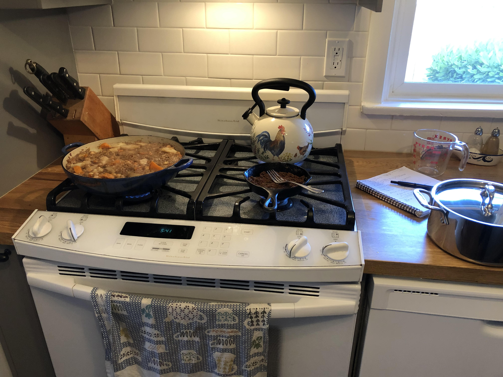

# Japanese Curry

Not 100% sure where I got it from originally but I think it was https://norecipes.com/japanese-curry-recipe-from-scratch/

Serves about 4.  I like to serve over sticky noodles, rice also works.

## For the pre-curry
* 2 tsp oil
* large onion, diced
* 1 cup baby carrots, cut into chunks
* 1 lb. Yukon gold potatoes, skinned and cut into chunks
* 1 apple, pureed
* 2 tsp kosher salt
* 1 tsp garam masala
* 1/2 cup peas
* 15oz can garbanzo beans, rinsed
* 4 cups water

## For the roux
* 3 tbsp. butter
* 1/4 cup flour
* 2 tbsp. garam masala
* 1 tbsp. ketchup
* 1 tbsp. vegan Worcestershire sauce (most aren't, look out!)

## PRE-CURRY STEPS
* briefly microwave potatoes (maybe 5 minutes).  The goal here is not to cook them but just soften them up a little.  Don't overdo it!  Undercooked potatoes will have an opportunity to soften while simmering, but overcooked potatoes you will have to throw out because that gluey stuff is gross
* briefly microwave the carrots (maybe 90 seconds), similar logic
* heat the oil in large saucepan over medium low heat and add the onions.  Sauté the onions until they're golden brown, stirring consistently.  turn heat to high, add garbanzo beans and lightly brown them.  It's okay if the onions get a little burned but I'd try to avoid it
* add water and carrots, bring to a boil
* lower heat to medium and add potatoes, pureed apple, salt, garam masala
* simmer for 30 minutes or until you can pass a fork through the carrots and potatoes

## ROUX STEPS
* melt the butter over medium-low heat
* add flour and garam masala, combining a fork until you have a thick paste
* add ketchup, Worcestershire sauce and combine
* continue to cook until the paste starts crumbling
* remove from heat and set aside until curry is ready

## CURRY
* combine roux with 1 cup of water and mix vigorously.  I use a mixer to avoid any chunks.  It should be more a uniform paste at this point. 
* add roux and 1 cup water to pre-curry pot.
* Stir gently and add peas and heat through.
* simmer until you get the desired consistency.  Add water if necessary
